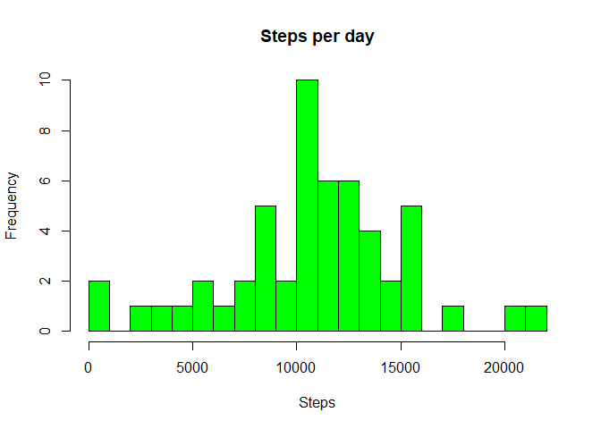
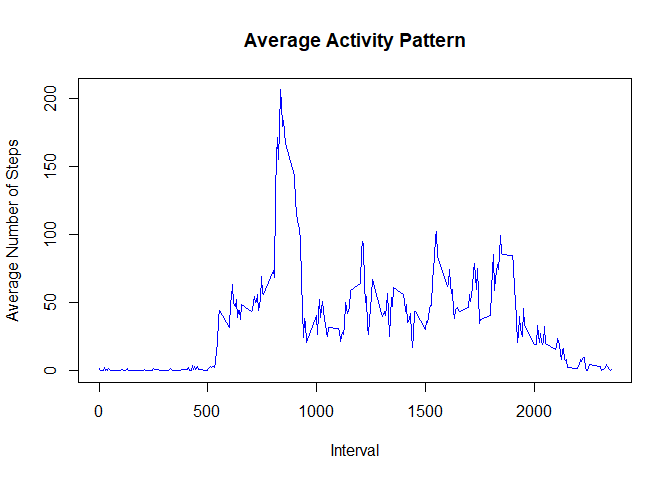
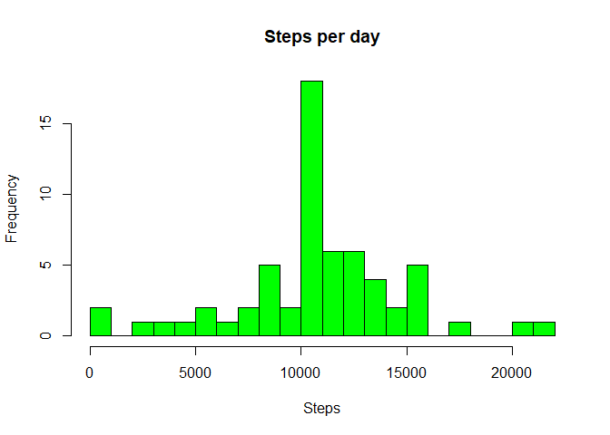
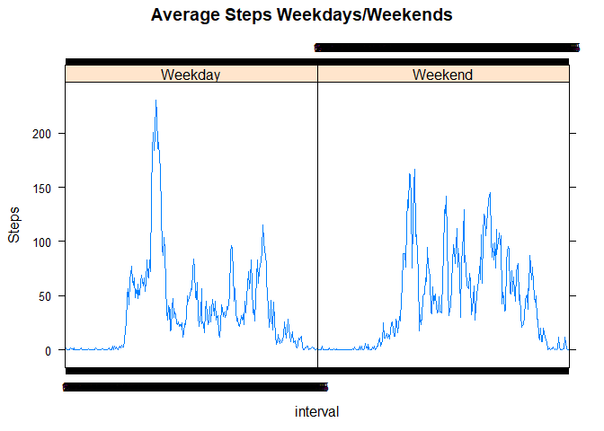

Reproducible Research: Peer Assessment 1
----------------------------------------

#### Author: David del Moral (<david.delmoral@gmail.com>)

#### 1. Loading and preprocessing the data

    # Load the data (i.e. read.csv())

    fileUrl <- "https://d396qusza40orc.cloudfront.net/repdata%2Fdata%2Factivity.zip"
    download.file(fileUrl, destfile = "./activity.zip")
    unzip("./activity.zip", overwrite = TRUE)

    activity_data<- read.csv("activity.csv", header = TRUE, sep = ",", na.strings = "NA")

    summary(activity_data)

    ##      steps                date          interval     
    ##  Min.   :  0.00   2012-10-01:  288   Min.   :   0.0  
    ##  1st Qu.:  0.00   2012-10-02:  288   1st Qu.: 588.8  
    ##  Median :  0.00   2012-10-03:  288   Median :1177.5  
    ##  Mean   : 37.38   2012-10-04:  288   Mean   :1177.5  
    ##  3rd Qu.: 12.00   2012-10-05:  288   3rd Qu.:1766.2  
    ##  Max.   :806.00   2012-10-06:  288   Max.   :2355.0  
    ##  NA's   :2304     (Other)   :15840

    str(activity_data)

    ## 'data.frame':    17568 obs. of  3 variables:
    ##  $ steps   : int  NA NA NA NA NA NA NA NA NA NA ...
    ##  $ date    : Factor w/ 61 levels "2012-10-01","2012-10-02",..: 1 1 1 1 1 1 1 1 1 1 ...
    ##  $ interval: int  0 5 10 15 20 25 30 35 40 45 ...

    # Process/transform the data (if necessary) into a format suitable for your analysis

    activity_data$date <- as.Date(activity_data$date, format = "%Y-%m-%d")

    activity_data$interval <- factor(activity_data$interval)

    NA_Idx <- is.na(as.character(activity_data$steps))

    activity_data_no_NA <- activity_data[!NA_Idx,]

    head(activity_data_no_NA)

    ##     steps       date interval
    ## 289     0 2012-10-02        0
    ## 290     0 2012-10-02        5
    ## 291     0 2012-10-02       10
    ## 292     0 2012-10-02       15
    ## 293     0 2012-10-02       20
    ## 294     0 2012-10-02       25

    steps_per_day <- aggregate(steps ~ date, data = activity_data_no_NA, sum)

    colnames(steps_per_day) <- c("date", "steps")

What is mean total number of steps taken per day?
-------------------------------------------------

    hist(as.numeric(steps_per_day$steps), breaks = 25, col = "green", xlab = "Steps", ylab = "Frequency", main= "Steps per day")

#### Mean

    mean(steps_per_day$steps)

    ## [1] 10766.19

#### Median

    median(steps_per_day$steps)

    ## [1] 10765

What is the average daily activity pattern?
-------------------------------------------

    # Calculating the average number of steps across all days
    steps_per_interval <- aggregate(activity_data_no_NA$steps, by=list(interval=activity_data_no_NA$interval), FUN=mean)

    colnames(steps_per_interval) <- c("interval", "average_steps")

    # 1. Make a time series plot (i.e. type = "l") of the 5-minute interval (x-axis) and the average number of steps taken, averaged across all days (y-axis)

    plot(as.integer(levels(steps_per_interval$interval)), steps_per_interval$average_steps, type="l",
          xlab = "Interval", ylab = "Average Number of Steps", main = "Average Activity Pattern",  col ="blue")

    ## Calculating the maximum number of steps
    # 2. Which 5-minute interval, on average across all the days in the dataset, contains the maximum number of steps?

    max_steps_per_interval <- max(steps_per_interval$average_steps)

    max_steps_per_interval

    ## [1] 206.1698

    interval_max_steps<-steps_per_interval[which.max(steps_per_interval$average_steps),]$interval

    interval_max_steps

    ## [1] 835
    ## 288 Levels: 0 5 10 15 20 25 30 35 40 45 50 55 100 105 110 115 120 ... 2355

#### the 5-minute interval that contains the maximum number of steps ( 206.2 steps ) is the interval 835

Imputing missing values
-----------------------

    # 1. Calculate and report the total number of missing values in the dataset (i.e. the total number of rows with NAs)

    # Missing data for steps

    sum(is.na(as.character(activity_data$steps)))

    ## [1] 2304

    # Missing data for date

    sum(is.na(as.character(activity_data$date)))

    ## [1] 0

    # Missing data for interval

    sum(is.na(as.character(activity_data$interval)))

    ## [1] 0

    # 2. Devise a strategy for filling in all of the missing values in the dataset. The strategy does not need to be sophisticated. For example, you could use the mean/median for that day, or the mean for that 5-minute interval, etc.

    NA_Idx <- which(is.na(as.character(activity_data$steps)))

    # 3. Create a new dataset that is equal to the original dataset but with the missing data filled in.

    complete_activity_data <- activity_data

    # Filling missing fields with the average (only steps data is missing)

    complete_activity_data[NA_Idx, ]$steps<-unlist(lapply(NA_Idx, FUN=function(NA_Idx){
         steps_per_interval[activity_data[NA_Idx,]$interval==steps_per_interval$interval,]$average_steps}))

    # Activity data complete

    summary(complete_activity_data)

    ##      steps             date               interval    
    ##  Min.   :  0.00   Min.   :2012-10-01   0      :   61  
    ##  1st Qu.:  0.00   1st Qu.:2012-10-16   5      :   61  
    ##  Median :  0.00   Median :2012-10-31   10     :   61  
    ##  Mean   : 37.38   Mean   :2012-10-31   15     :   61  
    ##  3rd Qu.: 27.00   3rd Qu.:2012-11-15   20     :   61  
    ##  Max.   :806.00   Max.   :2012-11-30   25     :   61  
    ##                                        (Other):17202

    str(complete_activity_data)

    ## 'data.frame':    17568 obs. of  3 variables:
    ##  $ steps   : num  1.717 0.3396 0.1321 0.1509 0.0755 ...
    ##  $ date    : Date, format: "2012-10-01" "2012-10-01" ...
    ##  $ interval: Factor w/ 288 levels "0","5","10","15",..: 1 2 3 4 5 6 7 8 9 10 ...

    steps_per_day_complete <- aggregate(steps ~ date, data = complete_activity_data, sum)

    colnames(steps_per_day_complete) <- c("date", "steps")

    # 4. Make a histogram of the total number of steps taken each day and Calculate and report the mean and median total number of steps taken per day. Do these values differ from the estimates from the first part of the assignment? What is the impact of imputing missing data on the estimates of the total daily number of steps?

    hist(as.numeric(steps_per_day_complete$steps), breaks = 25, col = "green", xlab = "Steps", main= "Steps per day")

    mean(steps_per_day_complete$steps)

    ## [1] 10766.19

    median(steps_per_day_complete$steps)

    ## [1] 10766.19

Are there differences in activity patterns between weekdays and weekends?
-------------------------------------------------------------------------

    # 1. Create a new factor variable in the dataset with two levels - "weekday" and "weekend" indicating whether a given date is a weekday or weekend day.

    complete_activity_data$day <- as.factor(weekdays(complete_activity_data$date))

    complete_activity_data$is_weekday <- ifelse(!(complete_activity_data$day %in% c("Saturday","Sunday")), TRUE, FALSE)

    weekdays_activity_data <- complete_activity_data[complete_activity_data$is_weekday,]

    steps_per_interval_weekdays <- aggregate(weekdays_activity_data$steps, by=list(interval=weekdays_activity_data$interval), FUN=mean)

    weekends_activity_data <- complete_activity_data[!complete_activity_data$is_weekday,]

    steps_per_interval_weekends <- aggregate(weekends_activity_data$steps, by=list(interval=weekends_activity_data$interval), FUN=mean)

    colnames(steps_per_interval_weekdays) <- c("interval", "average_steps")

    colnames(steps_per_interval_weekends) <- c("interval", "average_steps")

    steps_per_interval_weekdays$day <- "Weekday"

    steps_per_interval_weekends$day <- "Weekend"

    week_activity_data <- rbind(steps_per_interval_weekends, steps_per_interval_weekdays)

    week_activity_data$day <- as.factor(week_activity_data$day)

    # 2. Make a panel plot containing a time series plot (i.e. type = "l") of the 5-minute interval (x-axis) and the average number of steps taken, averaged across all weekday days or weekend days (y-axis). See the README file in the GitHub repository to see an example of what this plot should look like using simulated data.

    library(lattice)
    xyplot(average_steps ~  interval | day, data = week_activity_data, layout = c(2,1), type ="l", ylab="Steps", main="Average Steps Weekdays/Weekends")

    # According to the plot there is more activity over weekends.
